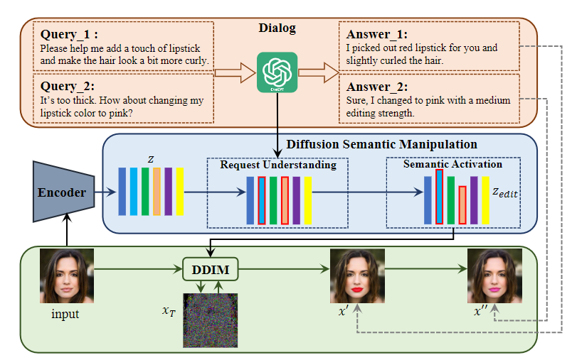
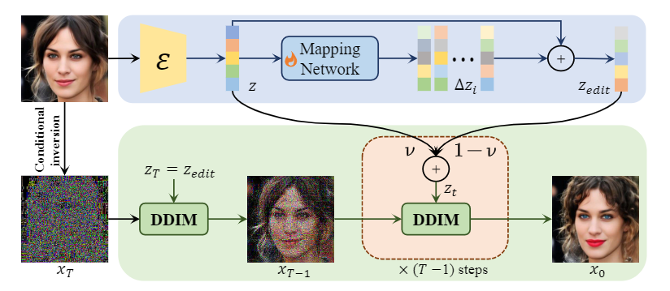
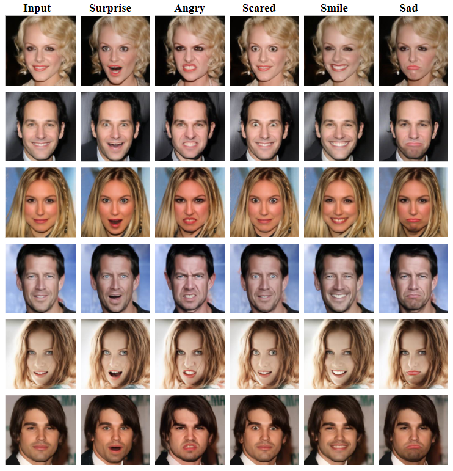
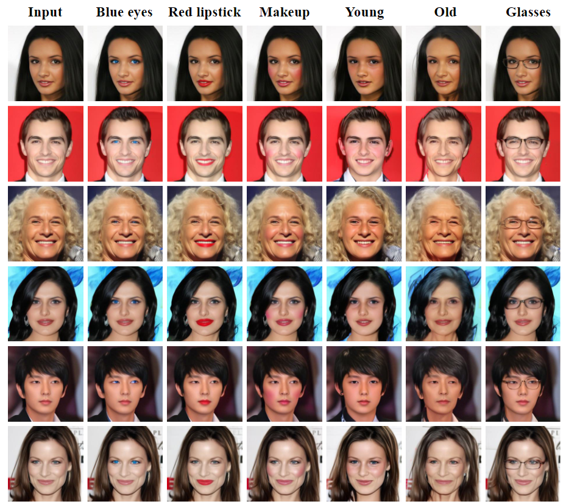
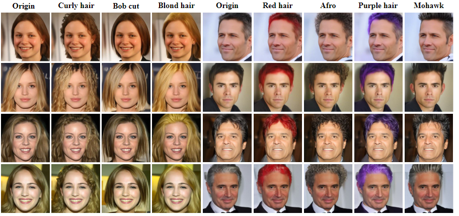
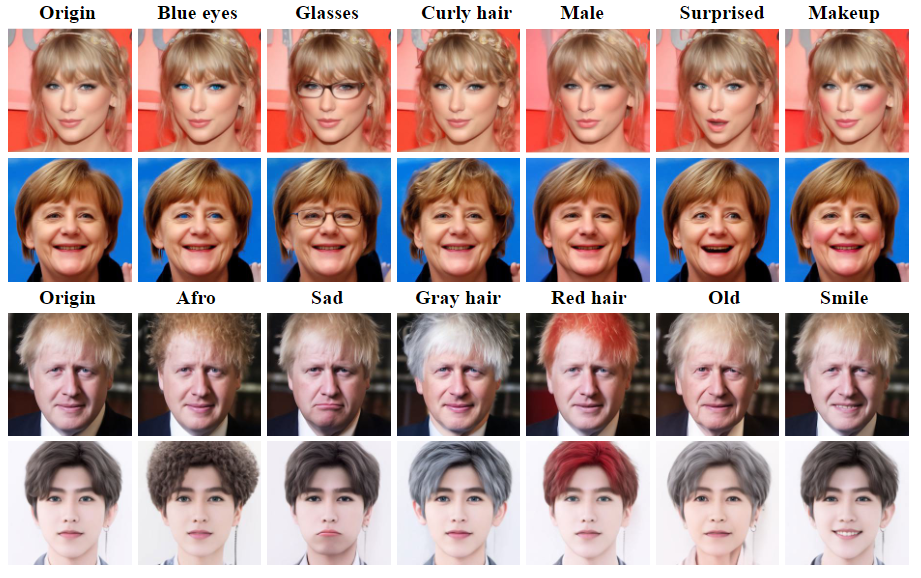
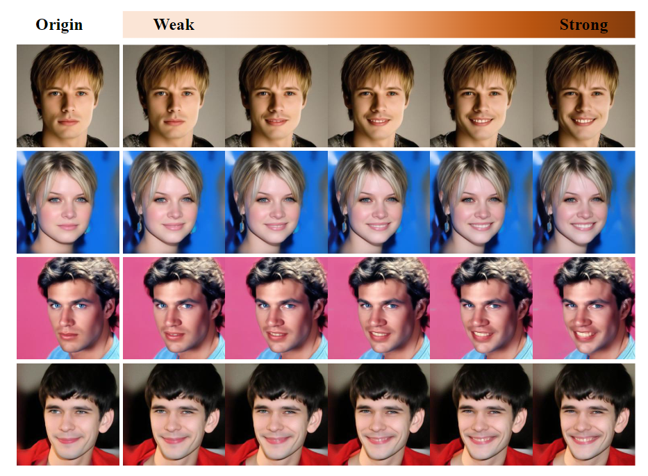
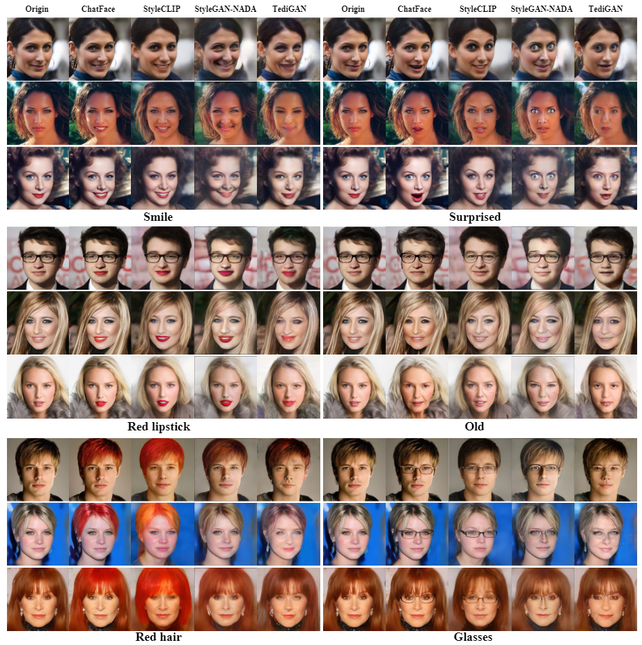
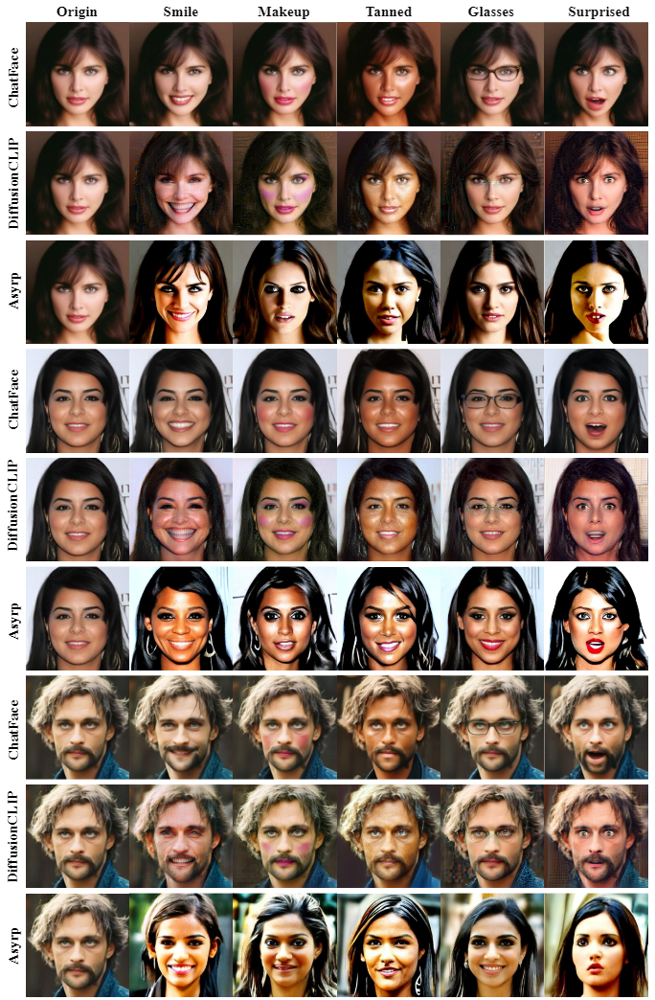

# ChatFace: Chat-Guided Real Face Editing via Diffusion Latent Space Manipulation

​																						paper    							

## Abstract

Editing real facial images is a crucial task in computer vision with significant demand in various real-world applications. While GAN-based methods have showed potential in manipulating images especially when combined with CLIP, these methods are limited in their ability to reconstruct real images due to challenging GAN inversion capability. Despite the successful image reconstruction achieved by diffusion-based methods, there are still challenges in effectively manipulating fine-gained facial attributes with textual instructions. To address these issues and facilitate convenient manipulation of real facial images, we propose a novel approach that conduct text-driven image editing in the semantic latent space of diffusion model. By aligning the temporal feature of the diffusion model with the semantic condition at generative process, we introduce a stable manipulation strategy, which perform precise zero-shot manipulation effectively. Furthermore, we develop an interactive system named ChatFace, which combines the zero-shot reasoning ability of large language models to perform efficient manipulations in diffusion semantic latent space. This system enables users to perform complex multi-attribute manipulations through dialogue, opening up new possibilities for interactive image editing. Extensive experiments confirmed that our approach outperforms previous methods and enables precise editing of real facial images, making it a promising candidate for real-world applications.

## ChatFace

 
         
 

## Results

## **More Results:** real image editing

## **More Results:**  multi-attribute manipulation 

## **More Results:**  editing strength control

## **Comparisons** with GAN-based, Diffusion-based methods

